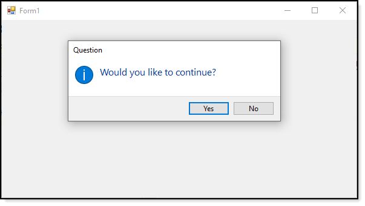

# Custom Window Forms dialog for C#

This repository provides code samples for displaying custom dialogs using [Windows-API-Code-Pack-1.1 NuGet package](https://www.nuget.org/packages/WindowsAPICodePack-Core/1.1.1), [source code repository](https://github.com/aybe/Windows-API-Code-Pack-1.1). It's not perfect as per issues below but does work well within limits.

For some creating a window form with normal buttons with DialogResult set for each button is always another way to go.

#### There are several issues:
- DetailsCollapsedLabel and DetailsExpandedLabel can cause buttons to display wrong when the text is rather long.
- DetailsExpandedText has the same issue as above.
