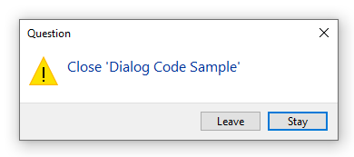
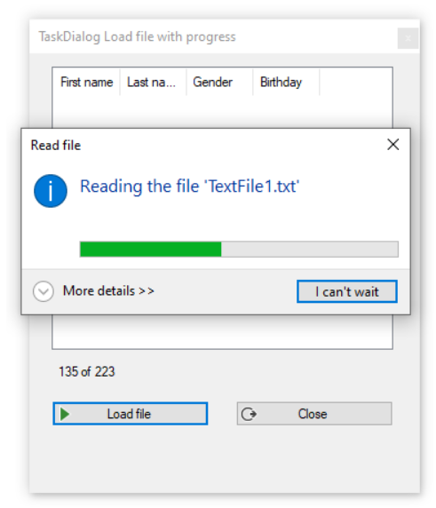
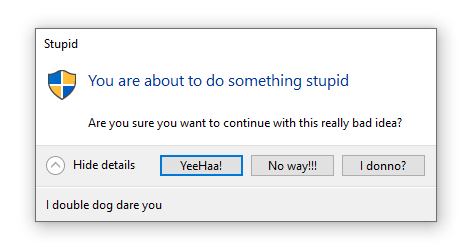
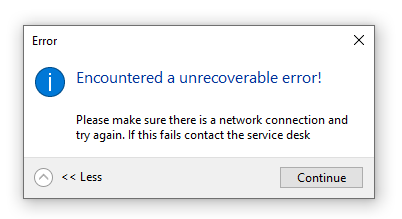

# Custom Window Forms dialog for VB.NET

This repository provides code samples for displaying custom dialogs using [Windows-API-Code-Pack-1.1 NuGet package](https://www.nuget.org/packages/WindowsAPICodePack-Core/1.1.1), [source code repository](https://github.com/aybe/Windows-API-Code-Pack-1.1). It's not perfect as per issues below but does work well within limits.

For some creating a window form with normal buttons with DialogResult set for each button is always another way to go.

#### There are several issues:
- DetailsCollapsedLabel and DetailsExpandedLabel can cause buttons to display wrong when the text is rather long.
- DetailsExpandedText has the same issue as above.

In both cases are extreme, should be fine for most cases.

The following is from the following Microsoft TeckNet article [section](https://social.technet.microsoft.com/wiki/contents/articles/53922.vb-net-reading-large-files-made-simple.aspx#Showing_progress) with full source. Note working with a progressbar requires a decent understanding of the dialog.

